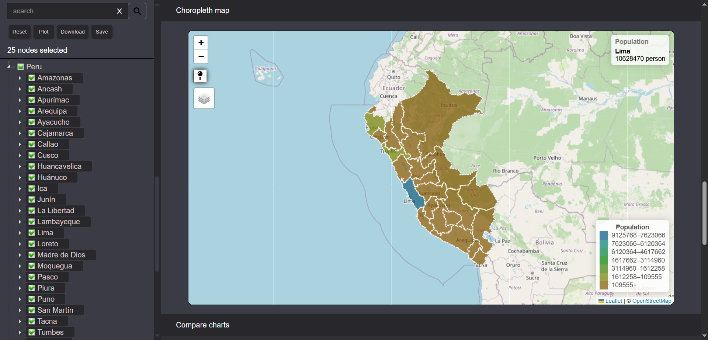

# Administrative divisions from OpenStreetMap

*Browse, compare, and export 178k+ administrative divisions with interactive maps and charts*

## What is this?
This is an interactive tool to explore, compare, and export administrative divisions from OpenStreetMap. Browse 178,000+ divisions across 70 countries via hierarchical tree or search, visualize on maps, compare stats, and download structured data.

### Basic usage
* Select divisions → Plot on map → View comparison tables, choropleth maps, and Wikidata links
* Download data as structured JSON or GeoJSON layers (both with hierarchy)
* Save and edit favorite selections in your session
* Use the rest API to directly get the hierarchy of each country

## Why did I build it?
OpenStreetMap offers a query to get administrative boundaries but there’s no direct way of getting and displaying the hierarchy and compare them. I’ve scraped, tested and collected other information of the structure in an easy to select, display and get compare table, charts and map from this divisions.

Others solutions like GADM are slow to update, Wikipedia lacks geometry and QGIS has steep learning curve.
This app gives researchers and journalists a fast way to explore current OSM data, compare divisions visually, and export analysis-ready files.

## How did I build it?

* Scraped 178k divisions from OSM using recursive Overpass API queries (via area element)
* Cleaned and validated through spatial checks and tag verification
* Using jstree, leaflet, turf and SPARQL Wikidata queries, I consolidated data and information into sections easy to use and navigate.
* Due to the type of data (178,000 nodes with geometries) several optimizations being done like caching, lazy loading and web workers to guarantee an easy to use experience

## Performance optimizations:

* Queries are done in the frontend to OSM. Taking advantage of OSM infrastructure avoids expensive storage/maintenance of duplicate geometry data and reduces load on the backend
* Divisions data (tags and geometry) are cached using indexedDB (100MB limit) to reduce queries and improve user experience
* Built a resumable Github workflows (scrape, clean and 3 spatial test) with persistent storage in backblaze b2
* Lazy loading on jstree by country to reduce total blocking time of page.
* Backend search being done in the backend.
* Web Workers for heavy calculations and map generations to not block the main thread.

## Stack:

* Data engineer: python, pandas, numpy, github actions, b2 backblaze
* Frontend: Vercel, node, javascript, react, react-chartjs-2, jstree, leaflet, turf, fortawesome and material UI
* Backend: Render, REST API, OAuth (jsonwebtoken), express, passport, postgreSQL , pg, zod, jest.
* User storage: Supabase

## Features:
* Select or search from 178,000+ administrative divisions within 70 countries
* Plot OSM polygons in a map with included tags
* Compare geospatial properties (area, perimeter, pop density) in sort-able tables
* Choropleth map for visual comparison
* Time series charts for computed properties.
* Save favorites and edit for quick access.
* Download tags and polygon data from OSM as json or geojson feature collection (both with hierarchy)
* REST API to get admin divisions structure for each country
* Wikidata integration for basic properties and population time series
